# CS 4331 VR COVID Project

This is my Aframe based VR project for the Texas Tech VR elective class in the CS department. This project was made to introduce many to the VR world and web based VR sites and Google Cardboard projects can be made with [Aframe](https://aframe.io/) and/or [THREE.js](https://threejs.org/). The project instructions were to create our view point and opinion about the COVID pandemic and how it effected us. In my project I chose my apartment room as my location as that's where I spend most of my time, both before and during the COVID pandemic.

You can view my project at this [link](https://sgo-nova.github.io/COVID-Aframe/) or watch my demo at this link.

## Models

_Alarm Clock_
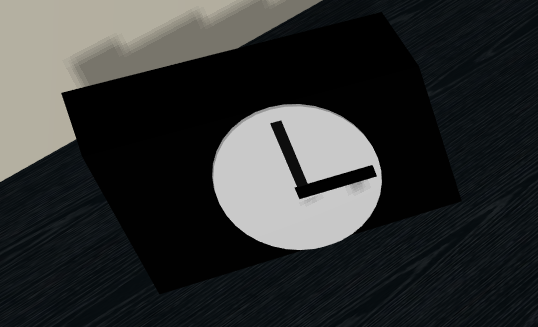
_Bed_
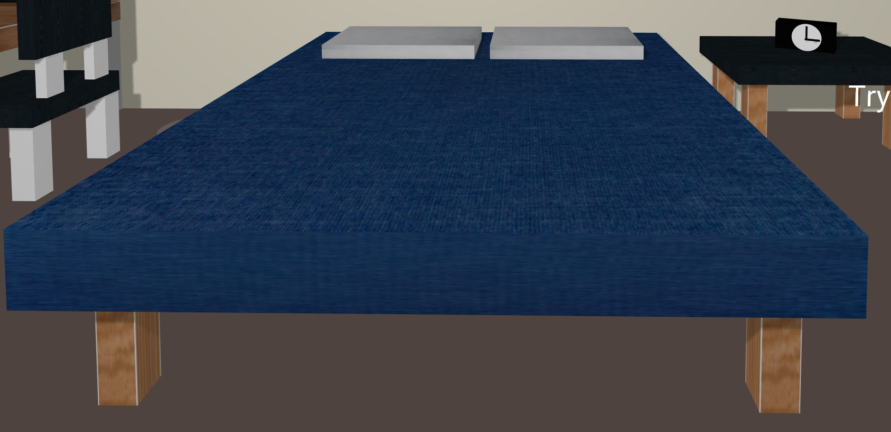
_Chair_
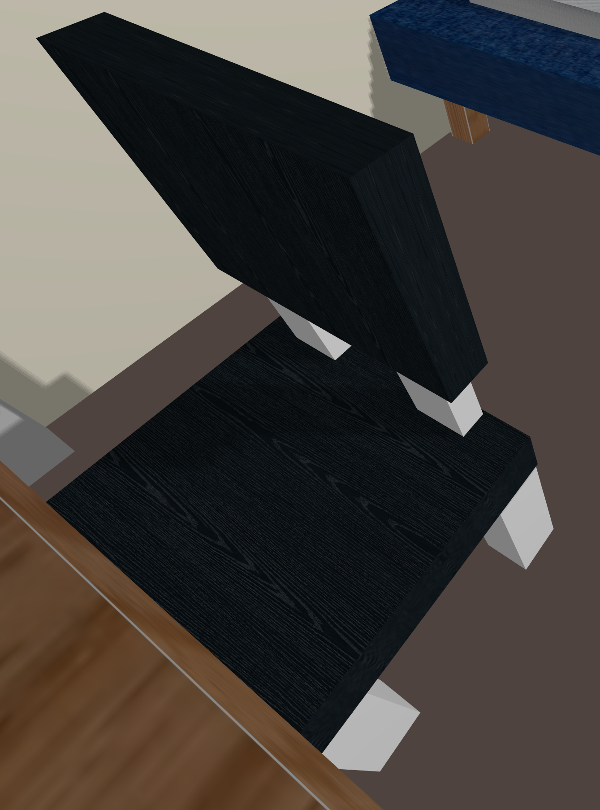
_Computer_
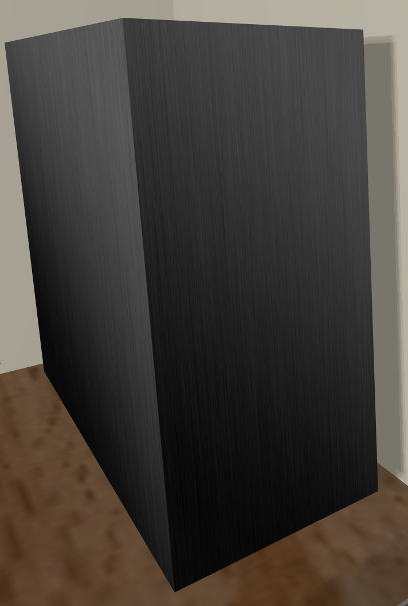
_Desk_
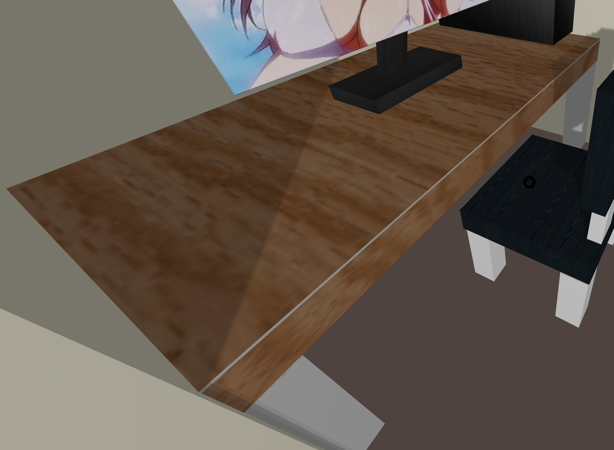
_Fan & Light_
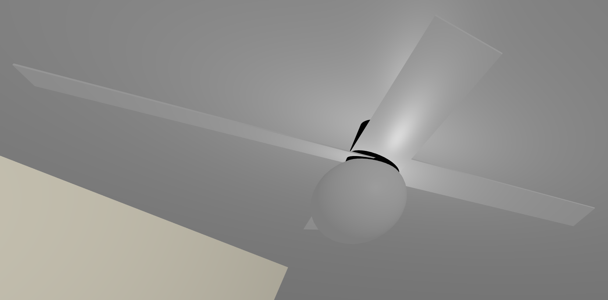
_Light Switch_
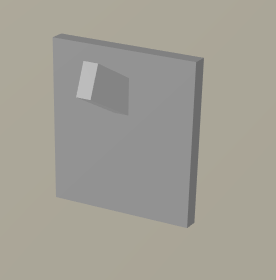
_Monitor_
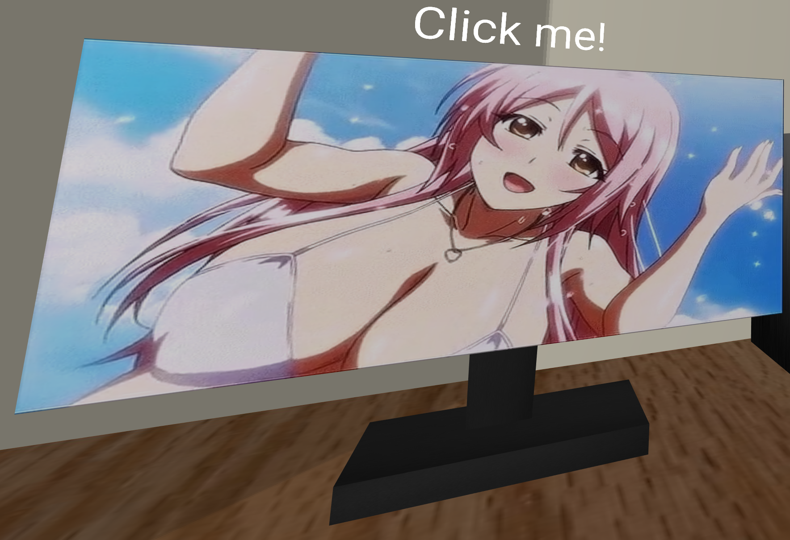
_Night Stand_
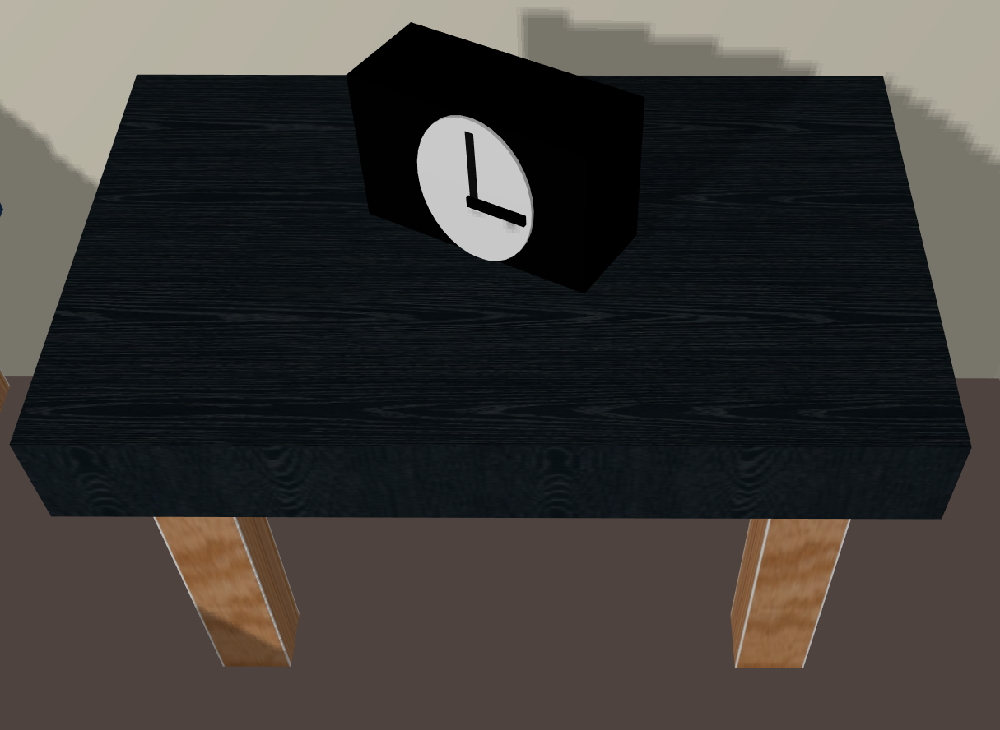
_Shirt_
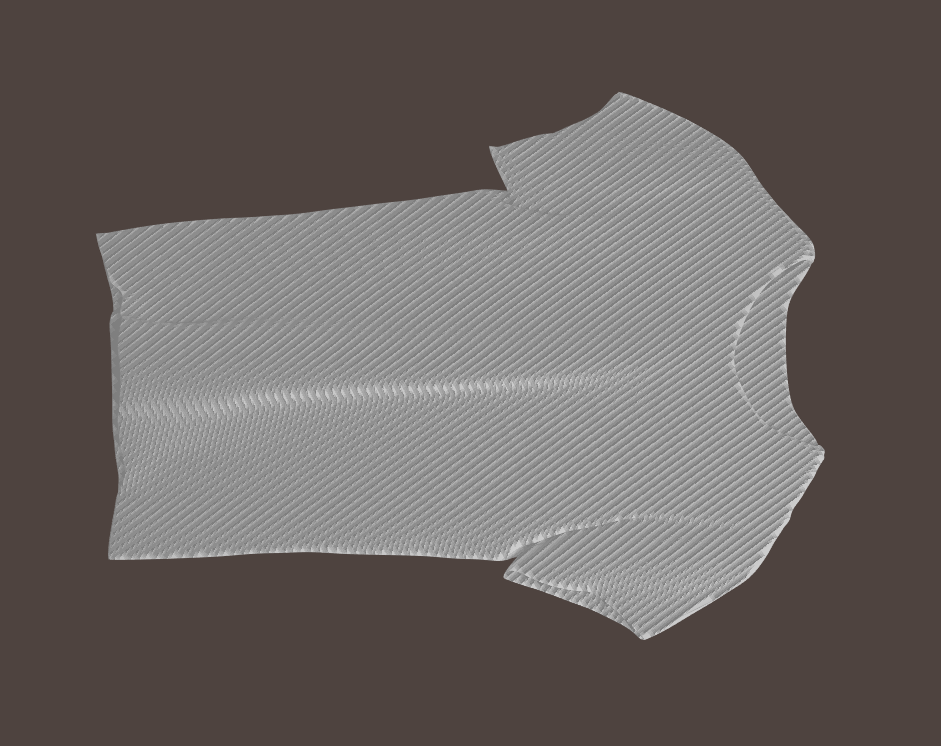
_Teleport Nodes_
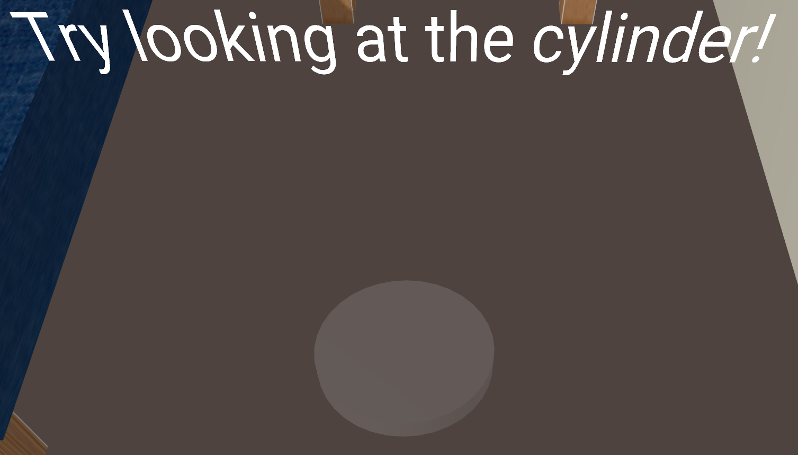
_TV_
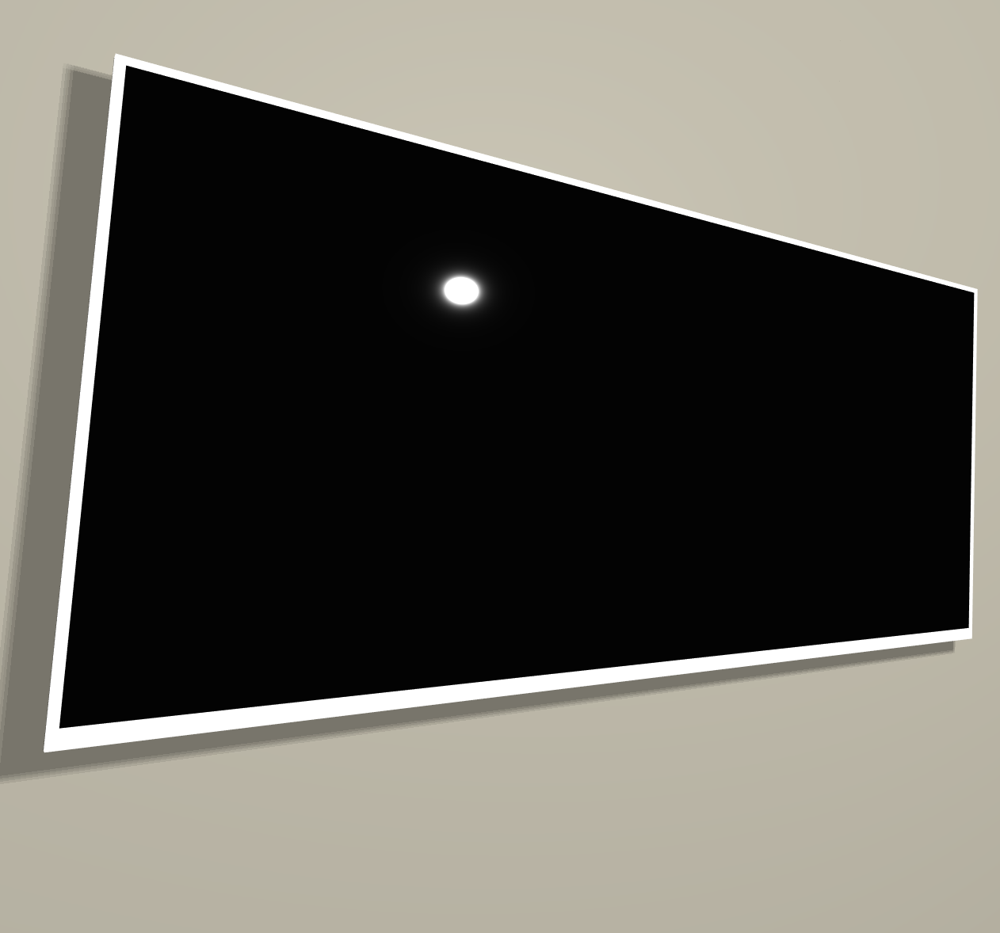
_Wall Art_
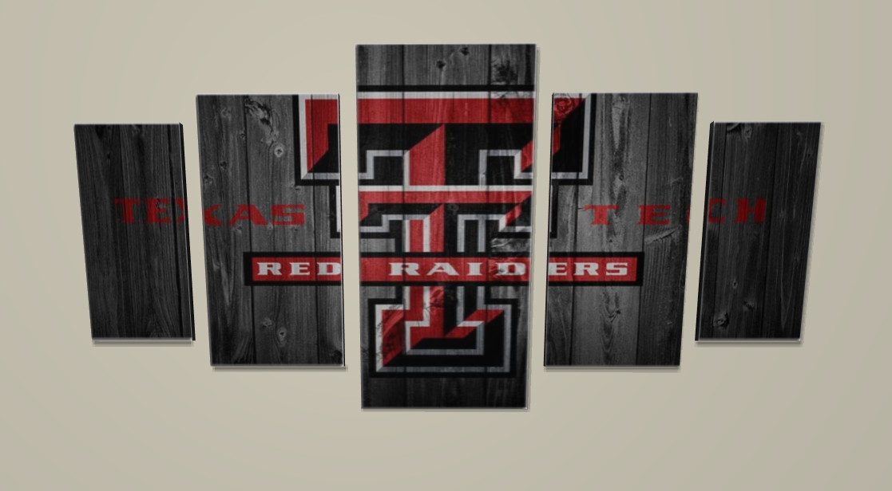
